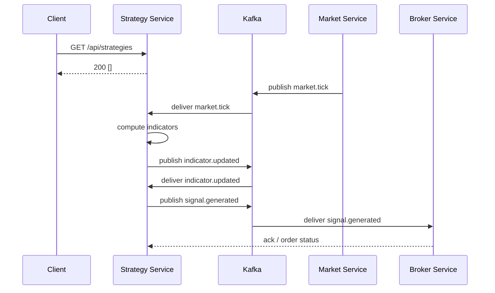

# Strategy Service - Flow Document

## Overview

This document describes the primary runtime flows for the `trade-strategy-service` including HTTP API interactions, Kafka-based market data flows, backtest publishing, persistence points, and integrations with other services (broker, market, auth).

## Actors

- Strategy Service (this service)
- Market Service (publishes market tick/candle messages)
- Broker Service (receives generated signals/orders)
- Kafka cluster (topics listed below)
- MySQL (persistence)

## Configs (notable values)

- HTTP port: configured in `src/main/resources/application.yml` (`server.port: 3022`)
- Datasource: jdbc:mysql://localhost:3306/tradding_db (see `spring.datasource`)
- Kafka topics (configured under `market.kafka.topics` in `application.yml`):
  - `market.tick` — raw tick events
  - `market.candle` — candlestick aggregates
  - `indicator.updated` — indicator updates
  - `signal.generated` — generated trading signals
  - `pattern.detected` — detected patterns

## High-level Flows

1. HTTP API Flow
   - Client calls `GET /api/strategies` to list strategies.
   - Client calls `GET /api/strategies/{id}` to fetch a strategy.
   - Client calls `POST /api/strategies` to create a strategy (currently echoes body).

2. Market Data → Indicator → Signal Flow
   - Market Service publishes messages to `market.tick` and `market.candle`.
   - Strategy Service consumes `market.tick`/`market.candle`.
   - Indicators are calculated (scheduler `indicator-delay-ms` in `application.yml` controls cadence).
   - Indicator results are published to `indicator.updated`.
   - Strategy logic consumes indicator updates and may emit signals to `signal.generated`.
   - Signals are also persisted (if `market.backtest.persist: true`) and optionally published for backtests.
   - Broker Service subscribes to `signal.generated` (or receives via `broker.service.url`) to execute or route orders.

3. Backtest Flow
   - Backtest runner publishes synthetic market data (or replays historic data) into `market.tick`/`market.candle`.
   - Strategy Service processes the data identical to live flows, publishing signals and optionally persisting results if `market.backtest.publish`/`persist` are enabled.

4. Management and Observability
   - Actuator endpoints exposed: `health`, `info`, `prometheus` (configured in `application.yml` under `management.endpoints.web.exposure.include`).
   - Logs and `logging.level` settings are configured under `logging.level`.

## Integration Points

- Broker service base URL: `http://localhost:3077/broker` (used for direct HTTP callbacks)
- Kafka bootstrap: `localhost:9092`
- MySQL: `localhost:3306` database `tradding_db` (consider renaming to `trading_db` if it's a typo)

## Error Handling & Retry

- Kafka consumer configuration includes `enable-auto-commit` and deserializer wrappers that support error handling (see `spring.kafka.consumer` in `application.yml`).
- Ensure idempotency for message processing where possible (dedupe keys or a processed-offset store) to handle retries.

## Deployment Notes

- Containerize with `Dockerfile` (exists in repository root).
- Ensure `application.yml` values are overridden via environment variables or ConfigMap in k8s manifests for non-local environments.

## Sample Commands

Fetch strategies (example):

```bash
curl -s http://localhost:3022/api/strategies
```

Create a strategy (example):

```bash
curl -s -X POST http://localhost:3022/api/strategies \
  -H "Content-Type: application/json" \
  -d '{"name":"sample-strategy","rules":[]}'
```

## Sequence Diagram (mermaid)



## Next Steps / TODOs

- Replace placeholder HTTP handlers with real service/DTO implementations.
- Wire Kafka consumers/producers to actual processing code.
- Validate database schema and rename `tradding_db` → `trading_db` if needed.

---
Generated by developer assistant on 2026-08-14.
